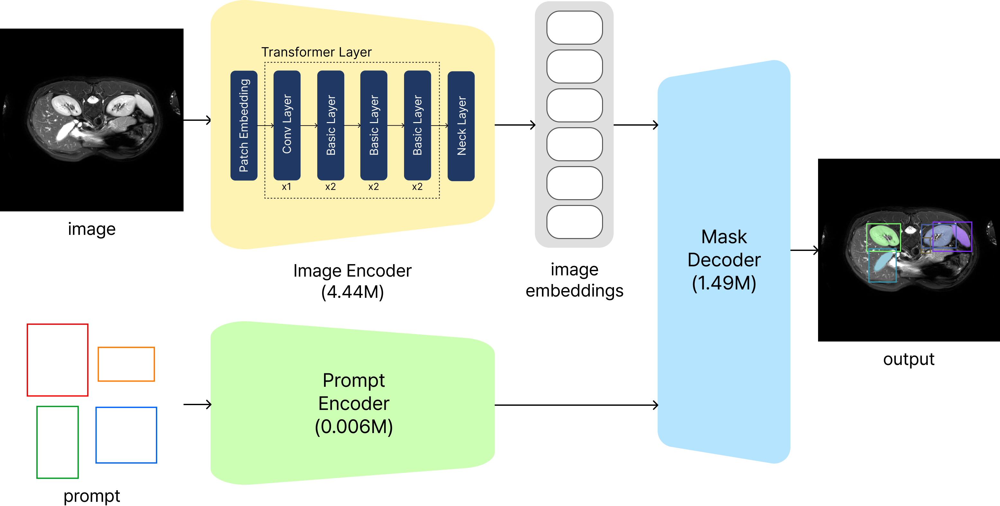

# SwiftMedSAM: An Ultra-Lightweight Prompt-based Universal Medical Image Segmentation Model for Highly Constrained Environments

Framework of our solution:


This repository offers the solution by Team snuhmii for the [CVPR 2024: Segment Anything In Medical Images On Laptop Challenge](https://www.codabench.org/competitions/1847/).

Further details of our method can be found in our paper: **[SwiftMedSAM: An Ultra-Lightweight Prompt-based Universal Medical Image Segmentation Model for Highly Constrained Environments](https://openreview.net/forum?id=8l8JVb7nUB&nesting=2&sort=date-desc)**.

Our work builds upon [MedSAM](https://github.com/bowang-lab/MedSAM).(LiteMedSAM) You can get our docker by:
```bash
docker pull kwangtai/swiftmedsam:latest
```

## Environments and Requirements

This repo is based on bowang-lab/MedSAM. The requirements of MedSAM should be satisfied, and our method doesn't demand any additional requirements. 
More details can be found at [MedSAM's repository](https://github.com/bowang-lab/MedSAM) 

To set up, follow:

```bash
git clone https://github.com/RACCOOONkim/CVPR2024-MedSAM-on-Laptop.git
cd CVPR2024-MedSAM-on-Laptop
pip install -e .
```

## Dataset

The training dataset includes a large-scale dataset with over one million image-mask pairs based on publicly available datasets. This dataset covers 11 imaging modalities, including Computed Tomography (CT), Magnetic Resonance Imaging (MRI), Positron Emission Tomography (PET), X-ray, ultrasound, mammography, Optical Coherence Tomography (OCT), endoscopy, fundus, dermoscopy, and microscopy.
Download the dataset [here](https://www.codabench.org/competitions/1847/#/pages-tab).


## 1. Train SwiftMedSAM
To train SwiftMedSAM using multiple GPUs, run the following commands
```bash
sh train_multi_gpus_KT2.sh
```

## 2. Inference with SwiftMedSAM

Finally perform medical image segmentation using SwiftMedSAM
```bash
python CVPR24_LiteMedSAM_infer_KT2.py -i INPUTS_FOLDER -o OUTPUTS_FOLDER -lite_medsam_checkpoint_path /work_dir/LiteMedSAM/modifiedv2_litemedsam_total.pth
```

## Results

Our method's performance on the [CVPR 2024: Segment Anything In Medical Images On Laptop Challenge](https://www.codabench.org/competitions/1847/#/pages-tab)'s final testing set is as follows:


| Target              | DSC(%)                   | NSD(%)                   | Runtime (s)              |
|---------------------|--------------------------|--------------------------|--------------------------|
| CT                  | 61.03                    | 65.56                    | 30.89                    |
| MR                  | 66.73                    | 68.62                    | 14.51                    |
| X-Ray               | 64.55                    | 77.04                    | 9.25                     |
| Endoscopy           | 91.55                    | 94.44                    | 7.37                     |
| Fundus              | 85.96                    | 88.15                    | 8.96                     |
| Microscopy          | 81.00                    | 83.00                    | 15.73                    |
| OCT                 | 71.09                    | 78.47                    | 7.84                     |
| PET                 | 79.30                    | 70.65                    | 12.09                    |
| US                  | 78.28                    | 84.63                    | 9.10                     |
| Average             | 75.50                    | 78.95                    | 12.86                    |

## Contributing

> Choose a license and describe the contribution guidelines for this code repository.

## Acknowledgements

We thank all the data owners for making the medical images publicly available and CodaLab [59] for hosting the challenge platform. This research was supported by a grant of ‘Korea Government Grant Program for Education and Research in Medical AI’ through the Korea Health Industry Development Institute(KHIDI), funded by the Korea government(MOE, MOHW), the NAVER Digital Bio Innovation Research Fund, funded by NAVER Corporation (Grant No. [3720230030]) and the Institute of Information & Communications Technology Planning & Evaluation(IITP)-Global Data-X Leader HRD program grant funded by the Korea government(MSIT)(IITP-2024-RS-2024-00441407).


## Citation

If you find this work useful, please cite:

```bibtex
@inproceedings{Kong2025SwiftMedSAM,
  author    = {Kong, Youngbin and Kim, Kwangtai and Jeong, Seoi and Lee, Kyu Eun and Kong, Hyoun-Joong},
  editor    = {Ma, Jun and Zhou, Yuyin and Wang, Bo},
  title     = {SwiftMedSAM: An Ultra-lightweight Prompt-Based Universal Medical Image Segmentation Model for Highly Constrained Environments},
  booktitle = {Medical Image Segmentation Foundation Models. CVPR 2024 Challenge: Segment Anything in Medical Images on Laptop},
  year      = {2025},
  publisher = {Springer Nature Switzerland},
  address   = {Cham},
  pages     = {180--194},
  isbn      = {978-3-031-81854-7},
  doi       = {10.1007/978-3-031-81854-7_12}
}

[Paper Link](https://openreview.net/forum?id=8l8JVb7nUB&nesting=2&sort=date-desc).
